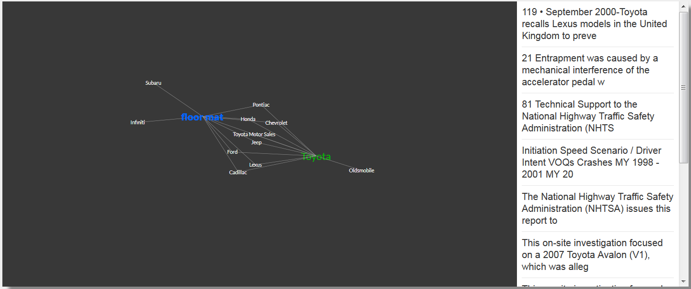

# discovery-visualization
Watson Discovery Network Graph Python 3 app



Special thanks to [zwalchuk](https://github.com/zwalchuk)
This app was modified from his original code https://github.com/zwalchuk/news-visualization

This Python app allows a user to query their own Watson Discovery Service collection and produce a network graph visualization.

#### To run this app:
1. Create an instance of [Watson Discovery Service](https://console.bluemix.net/catalog/services/discovery) on IBM Cloud
2. Clone this repo and navigate to the discovery-visualization directory:
```
git clone https://github.com/coolcat44/discovery-visualization.git
cd discovery-visualization
```
3. Copy the file ".env.example", rename the copy ".env", and provide the following parameters:
    * Provide the Watson Discovery Service `apikey` and `url` endpoind
    * Provide the Watson Discovery Service `collection_id` and `environment_id`
4. Modify manifest.yml if you'd like to add additional paramters or change the app's name

##### To run locally:
- Install the app's dependencies:
```
pip install -r requirements.txt
```
- Launch the app:
```
python visApp.py
```
- Running locally, enter serach term after URL after hostname and port
http://localhost:8000/<search term>
- E.g.,
http://localhost:8000/professor frink
- NOTE: If error `ImportError: No module named dotenv` occurs, run the app with
`python3 visApp.py`

##### To run on IBM Cloud:
1. Run the following command in the [IBM Cloud CLI](https://console.bluemix.net/docs/cli/reference/bluemix_cli/download_cli.html#download_install)
```
ibmcloud cf push
```
- After launching app URL, enter search term in the following format:
http://<app name>.mybluemix.net/<search term>
- E.g.,
http://<app name>.mybluemix.net/homer
